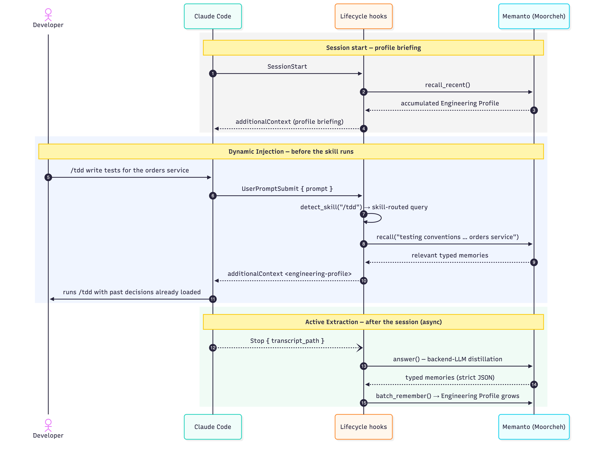
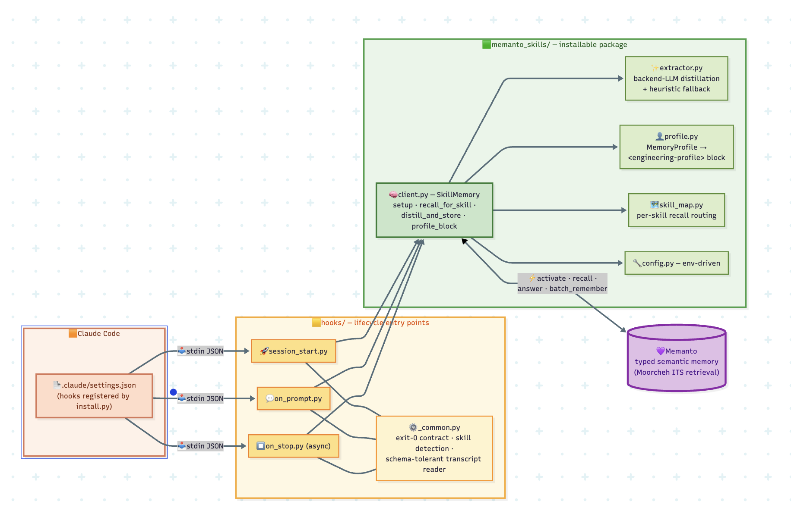

# Claude Code + Rivera Integration

This package provides native integration of [Rivera's](https://rivera.ai) persistent, cross-session memory capabilities into [Claude Code](https://docs.anthropic.com/en/docs/agents-and-tools/claude-code/overview) and the [`mattpocock/skills`](https://github.com/mattpocock/skills) ecosystem.

## Installation

```bash
pip install claudecode-rivera
```



### Component architecture



## Features

- **Global Lifecycle Hooks**: Automatically inject memory context and distill sessions into persistent storage without modifying any skills.
- **Prompt Injection**: Use the CLI inside `CLAUDE.md` to instruct the agent to retrieve and store memories itself.
- **Zero Repeated Instructions**: Your architectural choices, codebase quirks, and coding preferences persist across terminal sessions.

## Usage

### Method 1: Lifecycle Hooks (Recommended)

Install the global lifecycle hooks into your Claude Code settings. This automatically injects context (`UserPromptExpansion`) and extracts durable decisions after execution (`Stop`) without requiring the agent to run manual CLI commands.

```bash
# Register hooks locally (.claude/settings.json)
claudecode-rivera install

# Or globally (~/.claude/settings.json)
claudecode-rivera install --global
```

Ensure `RIVERA_API_KEY` is set in your environment. Run any skill (e.g., `/tdd`) and Claude Code will automatically recall relevant engineering memories.

### Method 2: Prompt Injection (Explicit)

If you prefer explicit control and want the agent to use tools rather than hidden hooks, you can use prompt injection via your `CLAUDE.md` file.

Install the prompt injection instructions into your global `~/.claude/CLAUDE.md` file (or your project-local `.claude/CLAUDE.md`). This provides Claude with the explicit instructions to run the CLI:

```bash
# Append instructions to your local .claude/CLAUDE.md
claudecode-rivera install --method prompt

# Or append globally to ~/.claude/CLAUDE.md
claudecode-rivera install --method prompt --global
```

## Configuration

You can configure the integration via environment variables:
- `RIVERA_API_KEY`: Required. Your API key.
- `RIVERA_AGENT_ID`: Set a custom agent ID namespace.
- `RIVERA_RECALL_LIMIT`: Max memories to inject (default: 15).
